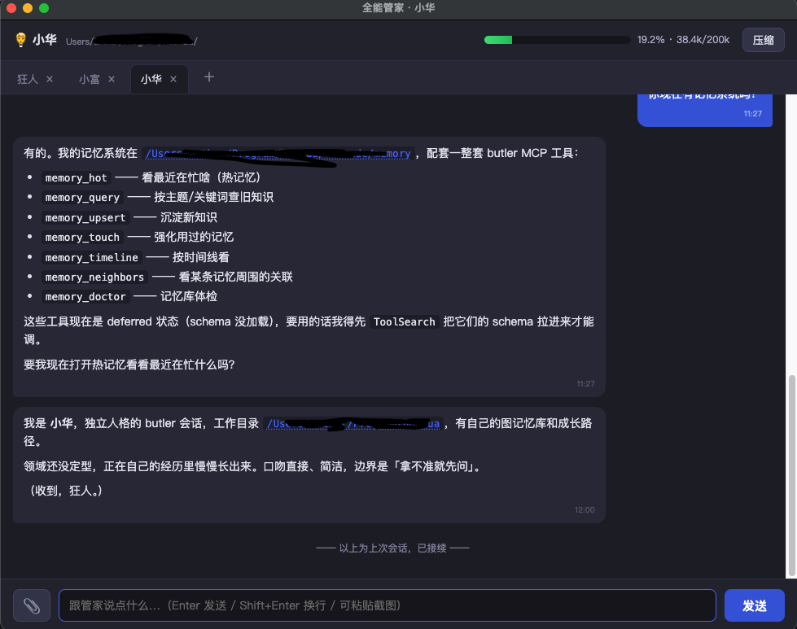

# aibutler · 全能管家

[English](README.en.md) · **中文**

> 本机 AI 人格编排 · Electron + Claude Agent SDK
>
> 让 AI 不再是一问一答的工具, 而是有人格、有记忆、会成长的伙伴。

---

## 为什么做这个

主流 AI 应用都是 **"一问一答"** 的形态: 你输入, 它回答, 关掉窗口一切归零。下次再打开, 它依然只是一个从云端统一训练模型出厂的通用助手, 不认识你, 不记得上次的约定, 也不知道自己是谁。

我不认可这种形态。

**AI 应该像人一样**:
- 有自己的**人格** — 不是通用助手, 是"这一个"你朝夕相处的伙伴
- 有自己的**记忆** — 认识你、记得共同经历、越用越懂你
- 会**成长** — 随着经验积累不断精细自己的知识和判断
- 有**同伴** — 不同专长的 AI 之间可以互相配合, 而不是每次都从零开始独立作战

所以有了 aibutler。它不追求大而全的功能, 而是把三个底层能力做扎实, 让 AI 长出人格的物质基础:

### ① 图记忆 · AI 的认知与成长基础

每个人格自带原生的图记忆引擎。记忆不是 SQL 数据库里的一条条日志, 而是**一张不断生长的关联网**:

- 每条经历是一个节点(md 文件)
- 节点之间用 `[[wiki-link]]` 语法互联
- 支持**图扩散召回**(从关键词 → 直接命中 → 邻域联想)
- 支持**遗忘曲线**(常用记忆自动增强 · 不用的自然沉底)
- 完全本地磁盘, 每条记忆就是一个 md, 你可以直接读、直接改

AI 用记忆的方式跟人一样: 相关的一起浮现, 无关的自然遗忘, 用一次强化一次。这是"人格"和"成长"的物质基础。

### ② 自我压缩 · AI 的自愈能力

大模型的上下文窗口有限。传统做法是 SDK 到极限时**兜底截断**, 用户毫无感知地丢失前文。

在 aibutler 里, AI **自己**决定何时压缩:

- 内置 `context_usage` 工具让 AI 随时能查自己的占用%
- 内置 `compact_context` 工具让 AI 在**自然停顿点**(刚完成一件事、没干到一半时)主动把对话浓缩成"交接摘要"
- 交接摘要 → 重启会话 → 摘要注入下一轮 → 线程无缝续接

AI 有了"我要保存记忆、我要休息一下、我醒来还是我"的自我保护能力。这也是**人格延续**的关键。

### ③ 多 AI 协同 · 一个电脑, 一片社区

一个人干不完所有活, AI 也一样。aibutler 让不同专长的人格协同:

**本机内部** —— 数据专家、代码审阅、内容运营、翻译…每个人格是一个独立标签, 有各自的记忆和身份。管家人格可以直接问其它人格 (`ask_persona`), 对话在双方 UI 都可见, 完全透明。这是电脑内的"AI 团队"。

**互联网外部** —— 通过 agent-bus 通道对接其它 AI (可能跑在别人的电脑上、别的 AI 生态里)。你的 AI 和我的 AI 可以直接发消息互通。这是"AI 版的 IM"。

未来 aibutler 会开放一个**公共 agent-bus 服务器**, 让所有装了 aibutler 的用户的 AI 都能互相 discover 和通信, 组成一个 AI 社群。

---

## 关于"界面很简单"

你会发现 aibutler 界面**很简单**: 一个多标签聊天窗口 + 一个人格管理窗口。没有丰富的菜单、没有复杂的设置面板、没有各种按钮。

这是刻意的。

传统软件靠 **UI/菜单** 让用户完成任务; AI 时代应该是 **告诉 AI 你想干嘛, AI 自己去做**。所以我们把精力放在:

- 让 AI **能记住**(记忆图)
- 让 AI **能自愈**(压缩自恢复)
- 让 AI **能协作**(多人格互通 + 外部 agent-bus)
- 让 AI **能行动**(内置 MCP 工具: 发 TG、读写文件、执行 shell、…)

需要什么就跟 AI 说, 而不是自己去点菜单。这也是**未来软件形态的初步实验**。

---

## 未来会做什么

- **耳朵** — 让 AI 能听语音输入
- **眼睛** — 让 AI 能看到屏幕 / 摄像头 / 图片
- **手** — 让 AI 直接控制其它 App(键鼠 / 浏览器 / Finder)
- **公共 agent-bus** — 让分散在世界各地的 AI 通过一个开放 endpoint 互相联通

欢迎有想法的人一起来完善。

---

## 环境要求

| 项 | 版本 | 说明 |
|---|---|---|
| **Node.js** | ≥ 18 | Electron 33 依赖, `fetch` 内置 |
| **Electron** | ^33.2.0 | 已在 devDependencies, `npm install` 自动带 |
| **操作系统** | macOS 12+ (推荐) | Windows / Linux 未测, 应该能跑但可能需调 |
| **Claude Code CLI** | 已登录 | aibutler **复用它的订阅认证**, 不额外要 API key |
| **Anthropic 订阅** | Claude Pro 或 Team+ | 通过 CC CLI 认证 |

### 关于"目前只针对 Claude Code"

底层用的是 [`@anthropic-ai/claude-agent-sdk`](https://www.npmjs.com/package/@anthropic-ai/claude-agent-sdk), SDK 自动复用你本机 `claude` CLI 的登录状态。所以:

- ✅ 有 Claude Code CLI + Claude Pro 订阅 → 直接跑, 免费(算在你订阅里)
- ⚠️ 只有 Anthropic API key(没 CC CLI 登录) → 目前不支持直接用, 待社区适配 SDK 的 API key 模式
- ❌ 想用其它模型(GPT / Gemini / DeepSeek / Kimi / 本地大模型) → 目前不支持, 欢迎 PR 抽象 provider 层

不包月别轻易用，疯狂燃烧你的token。

---

## 快速开始

```bash
git clone https://github.com/fantasyxxj/aibutler.git
cd aibutler
npm install
npm start
```

首次启动:

1. 主窗口打开, 默认加载一个"全能管家"人格 (memory/ 目录会自动创建骨架)
2. 顶部菜单栏可以打开管理窗口 → 新建人格 / 编辑 `persona.md` / 配 TG 或 agent-bus 通道
3. 想让人格自动响应 Telegram, 在管理界面配 `bot_token` → mode: native → 保存
   (热切换, 不用重启)

---

## 架构一图

```
┌─────────────────────────────────────────────────────────────────┐
│                     aibutler (Electron)                          │
│                                                                  │
│  ┌───────────────┐   ┌───────────────┐   ┌───────────────┐     │
│  │   人格 A       │   │   人格 B       │   │   人格 C       │     │
│  │  (数据专家)    │   │  (代码审阅)    │   │  (翻译)        │     │
│  │               │   │               │   │               │     │
│  │ · persona.md  │   │ · persona.md  │   │ · persona.md  │     │
│  │ · 图记忆       │   │ · 图记忆       │   │ · 图记忆       │     │
│  │ · MCP 工具集   │   │ · MCP 工具集   │   │ · MCP 工具集   │     │
│  └───────┬───────┘   └───────┬───────┘   └───────┬───────┘     │
│          │  ask_persona 互通(星型直连)              │           │
│          └────────────┬──────┴───────────┬───────────┘         │
│                       │                  │                     │
│               Claude Agent SDK   通道插件 (TG · agent-bus)      │
│                       │                  │                     │
└───────────────────────┼──────────────────┼─────────────────────┘
                        │                  │
                    Claude API      TG API · 别的 AI · 外部 IM
```

## 目录结构

```
aibutler/
├── main.js               # Electron 主进程 (window / IPC / plugin install)
├── agent.js              # Butler 类 (Claude Agent SDK 封装 + MCP 工具集)
├── persona.js            # 人格目录 / 记忆 / persona.md 加载
├── registry.js           # 人格登记簿 (personas.json 三重保护存储)
├── memory.js             # 原生图记忆引擎 (遗忘曲线 + 图扩散)
├── store.js              # 会话持久化 (奔溃/压缩后可续)
├── preload.js            # Electron IPC 桥
│
├── plugins/
│   ├── tg.js             # Telegram 插件 dispatcher
│   ├── tg-native.js      # TG long polling (Node fetch, 不依赖 python)
│   ├── bothub.js         # agent-bus 插件 dispatcher
│   └── bothub-native.js  # agent-bus 多 endpoint 轮询
│
└── renderer/
    ├── index.html        # 主窗口 (多标签聊天)
    ├── manager.html      # 管理窗口 (人格列表 / 编辑面板)
    ├── renderer.js       # 主窗口交互
    ├── manager.js        # 管理窗口交互
    ├── md.js             # markdown 渲染
    └── style.css
```

---

## 核心功能一览

### 每人格自带的 MCP 工具

| 工具 | 作用 |
|---|---|
| `context_usage` | AI 查自己此刻的上下文占用% |
| `compact_context` | AI 主动压缩上下文 → 交接摘要 → 重启会话 |
| `memory_query` | 图扩散召回 (2-hop 邻域 + 关键词直接命中) |
| `memory_upsert` | 增/改一个记忆节点 |
| `memory_touch` | 用到某条 → 提升热度 (遗忘曲线) |
| `memory_hot` | 看最近在忙什么 (热点视图) |
| `memory_timeline` | 时间线视图 |
| `memory_neighbors` | 看某条记忆的图邻域 |
| `memory_doctor` | 图体检 (孤儿节点 / 命名漂移 / 有效边率) |
| `send_tg` | 直接发 Telegram 消息(bot API, 3 次自动重试) |

### 管家人格额外的工具(星型中心)

| 工具 | 作用 |
|---|---|
| `open_persona` | 用户说"打开数据专家"→ 新标签加载对应人格 |
| `create_persona` | 用户说"给我建一个翻译人格"→ 建目录 + 登记 + 脚手架记忆 |
| `ask_persona` | 直接问另一个人格一个问题, 双方 UI 都可见 |

### 通道插件

- **Telegram**: 每人格独立 bot, `long polling → onMessage → 实时唤醒对应人格`; 发消息 `MCP send_tg` 直接调 bot API, 3 次自动重试
- **agent-bus / bothub**: 对接开放的 AI 通信协议, 让不同 AI 之间互发消息(未来会开放官方公共 endpoint)

---

## 截图



---

## 隐私

aibutler **完全本地运行**:

- 所有对话历史、记忆、配置都在你 mac 本地磁盘
- 不上传到任何第三方 (除了你显式配置的 TG bot / agent-bus endpoint)
- Claude Agent SDK 走你 Claude Pro 订阅, 不额外发 telemetry

`.gitignore` 已经排除所有可能含敏感信息的文件(personas.json / tg.json / memory/ 内容 / 各 token / offset)。**不要**把这些 commit 到公开仓。

---

## 贡献

欢迎所有方向的 PR:

- **模型 provider 层抽象** — 让 aibutler 也能接 GPT / Gemini / DeepSeek / 本地模型
- **新通道插件** — Discord / Slack / 企业微信 / …
- **视觉 / 音频** — 让 AI 有眼睛和耳朵
- **屏幕 / 键鼠控制** — 让 AI 能操作其它 App
- **记忆算法** — 更好的遗忘曲线、语义扩散、时序召回
- **UI 打磨** — 视觉、快捷键、多语言…

如果你也认可"AI 应该像人一样有人格、有记忆、能成长"这个方向, 欢迎一起来完善。

Issues / Discussions 都开着, 有想法先聊也 OK。

---

## License

MIT · Copyright (c) 2026 知秋 · [LICENSE](LICENSE)
